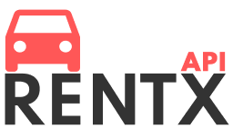

<h1 align="center">
  <br>
  <b>RentX: Car rentals 🚘</b>
</h1>

<p align="center">
  
  
  
  
</p>

<p align="center">
  <a href="#computer-project">Project</a>&nbsp;&nbsp;&nbsp;|&nbsp;&nbsp;&nbsp;
  <a href="#rocket-technologies">Technologies</a>&nbsp;&nbsp;&nbsp;|&nbsp;&nbsp;&nbsp;
  <a href="#seat-getting-started">Getting started</a>&nbsp;&nbsp;&nbsp;|&nbsp;&nbsp;&nbsp;
  <a href="#thinking-how-to-contribute">How to contribute</a>&nbsp;&nbsp;&nbsp;|&nbsp;&nbsp;&nbsp;
  <a href="#pencil-license">License</a>
</p>

## :computer: Project

**RentX** is a rental car management platform that allows you to manage your vehicles, categories, specs, and of course, your rentals!

## :rocket: Technologies

This project was developed with the following technologies:

- [Node.js](https://nodejs.org)

Extras:

- Main Libs
  - [Express](https://expressjs.com)
- Style
  - [EditorConfig](https://editorconfig.org)
  - [ESLint](https://eslint.org)
  - [Prettier](https://prettier.io)

## :seat: Getting started

These instructions will get you a copy of the full project up and running on your local machine for development and testing purposes.

### Setting up the development environment

The project is developed using Git. Git is a free and open-source distributed version control system. [Download Git](https://git-scm.com/downloads).

The project can be built with npm or Yarn, so choose one of the following approaches if you don't have any installed on your system.

- **npm** is distributed with Node.js which means that when you download Node.js, you automatically get npm installed on your computer. [Download Node.js](https://nodejs.org/en/download/).
- **Yarn** is a package manager built by Facebook Team and seems to be faster than npm in general. [Download Yarn](https://yarnpkg.com/en/docs/install).

### Cloning the project

You can obtain the project by running the following instruction on your terminal:

```bash
git clone https://github.com/diegomais/rentx.git
cd rentx
```

### Installing dependencies

You can install the dependencies by running the following instruction on your terminal inside the project directory:

```bash
npm install
```

or

```bash
yarn install
```

### Running the application

You can run the application by running the following instruction on your terminal inside the project directory:

```bash
npm run dev
```

or

```bash
yarn dev
```

You can now use the API at [http://localhost:3333](http://localhost:3333).

## :thinking: How to contribute

- Fork this repository;
- Create a branch with your feature: `git checkout -b my-feature`;
- Commit your changes: `git commit -m '[feat](scope) My new feature'`;
- Push to your branch: `git push origin my-feature`.

After the merge of your pull request is done, you can delete your branch.

## :pencil: License

This project is under the MIT license. See the [LICENSE](LICENSE) for more details.

---

Made with :heart: by [Diego Mais](https://diegomais.github.io) :wave:.
